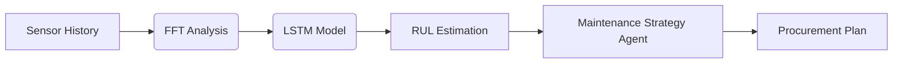

# Predictive Maintenance Intelligence

> **AI-Driven Grid Reliability | RUL Estimation for Power Generation Assets**

[](https://opensource.org/licenses/MIT)
[](https://davidfernandez.dev)
[](https://huggingface.co/spaces/davidfertube/predictive-agent)
[](https://www.python.org/)

## Overview

**Predictive Agent** is a production-grade LSTM-based RUL prediction system that extends turbine life 15-20% by accurately forecasting equipment failures. Trained on NASA C-MAPSS data and adapted for GE 7FA turbine patterns, this system enables proactive maintenance scheduling before degradation becomes critical.

## System Architecture



## Key Features

- **RUL Prediction**: Estimates cycles remaining before equipment reaches critical health threshold
- **Agentic Strategy**: Uses Mistral-7B to generate maintenance plans based on predicted failure windows
- **Multivariate Health Index**: Combines temperature, vibration, and pressure into unified asset health score
- **Predictive Guardrails**: Automated early warning alerts 48 hours before predicted failure

## Technical Stack

| Component | Technology |
|-----------|------------|
| Modeling | Scikit-Learn, PyTorch LSTM |
| Strategy Agent | Mistral-7B (HF Inference) |
| Visualization | Plotly, Gradio |
| Infrastructure | Python 3.9+, Docker |

## Quick Start

```bash
git clone https://github.com/davidfertube/predictive-maintenance.git
cd predictive-maintenance
pip install -r requirements.txt
python app.py
```

## Project Structure

```
predictive-maintenance/
├── src/
│   ├── maintenance_engine.py  # RUL Prediction & Strategy Agent
│   └── model.py               # LSTM Architecture
├── app.py                     # Gradio Dashboard
└── requirements.txt
```

## Energy Industry Applications

- **Gas Turbine Monitoring**: Predict compressor and turbine blade failures
- **Grid Transformer Health**: Estimate transformer RUL from oil analysis trends
- **Rotating Equipment**: Monitor pumps, motors, and generators

---

**David Fernandez** | Applied AI Engineer | LangGraph Core Contributor

- [Portfolio](https://davidfernandez.dev) • [LinkedIn](https://linkedin.com/in/davidfertube) • [GitHub](https://github.com/davidfertube)

MIT License © 2026 David Fernandez
